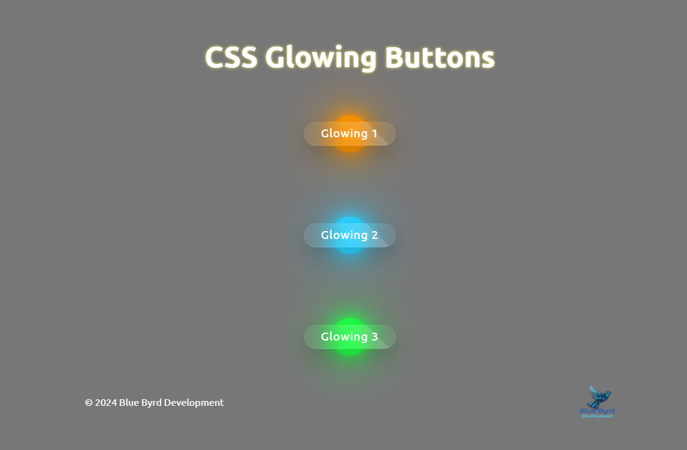

# Glowing Buttons

# Description
This project is a simple web application that displays a glowing button. The button changes to the background color when hovered over. 
# Learning
I am learning different techniques with CSS. Trying to get more comfortable doing different aspects. This one I used transition-delay and backdrop-filter to create the glowing effect. Using :before is where I added the acual button shape although I used an a tag and div instead of the button tag in the HTML.
# Author
**Karen Byrd**
  
*2024*
 
*Blue Byrd Development* &nbsp; &nbsp;  &nbsp;

 

